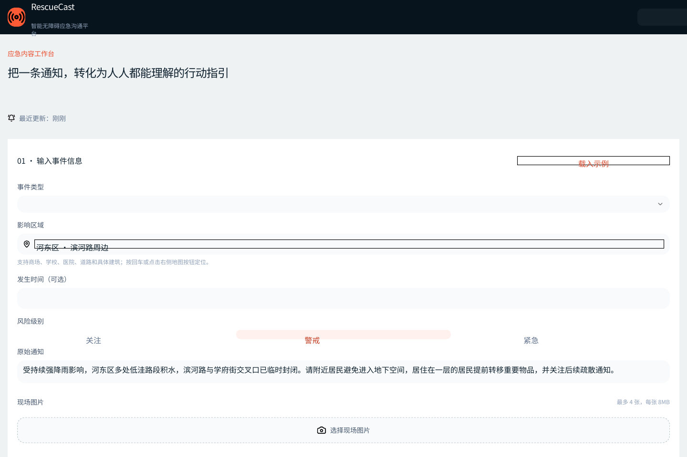
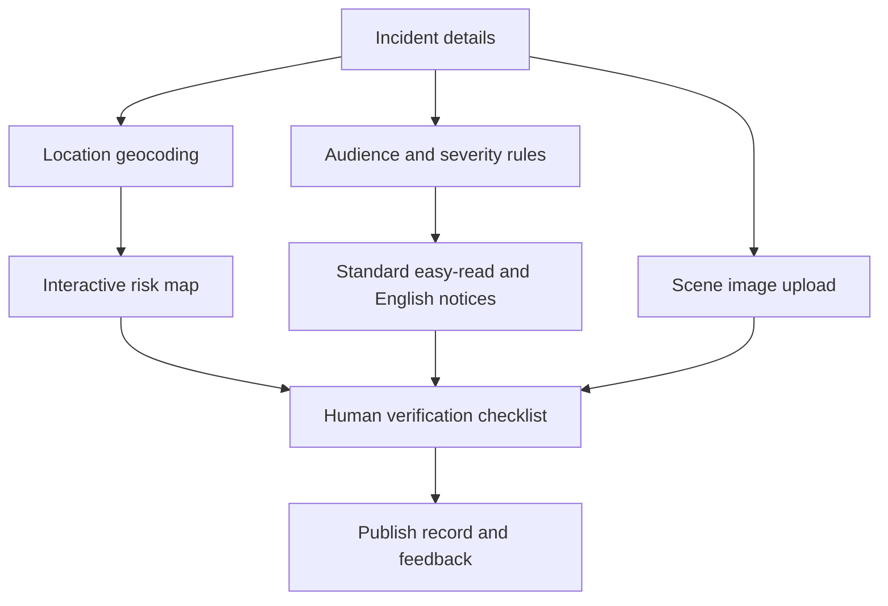

# RescueCast

**An accessible emergency-communication workspace for turning complex notices into clear, actionable messages.** RescueCast combines structured incident input, real map positioning, easy-read and multilingual outputs, audience-specific guidance, human review, scene images, and one-time feedback in a single public-information workflow.

[Live demo](https://rescuecast.onrender.com/) · [Chinese guide](README.zh-CN.md) · [Validation](docs/VALIDATION.md)



## Why this project

Emergency information often arrives as dense paragraphs at the moment when people have the least time and attention to interpret it. Generic notices may also exclude older adults, children, deaf users, non-native speakers, or people with cognitive accessibility needs. RescueCast explores how one incident record can produce several audience-appropriate views while keeping a human reviewer in control before publication.

## Core capabilities

- Configure incident type, severity, affected area, time, source notice, and priority audiences.
- Choose from ten incident types or enter a custom emergency type.
- Enter a specific place and position the map through server-side geocoding.
- Display a draggable and zoomable OpenStreetMap with a highlighted risk radius.
- Generate a standard public notice, easy-read version, English summary, action checklist, and accessibility panel.
- Read the easy-read notice aloud using browser speech synthesis.
- Upload up to four scene images, each no larger than 8 MB.
- Require a three-item human verification checklist before publishing.
- Save draft/published events in the current interface history.
- Record one helpful/unhelpful vote per anonymous browser identity.
- Support large text, enhanced contrast, and reduced-motion preferences.

## Workflow



## Accessible communication design

| Need | Product response |
| --- | --- |
| Cognitive load | Short easy-read message and three priority actions |
| Hearing access | Visual alert structure and text-first workflow |
| Language access | Parallel English summary for the configured incident |
| Low vision | Large-text and high-contrast controls |
| Motion sensitivity | Reduced-motion preference |
| Location clarity | Search-based map positioning and explicit affected-area text |
| Safety governance | Mandatory human review before publication |

The generated content is rule-based and deterministic. It is a communication prototype, not an official warning system, hazard model, dispatch service, or substitute for emergency authorities.

## Technology

- **Application:** TypeScript, React 19, Next.js 16, Tailwind CSS
- **Mapping:** Leaflet, React Leaflet, OpenStreetMap tiles
- **Geocoding:** ArcGIS World Geocoding with Nominatim fallback
- **Persistence:** Node.js SQLite for feedback and image metadata; local file storage for images
- **Accessibility:** semantic controls, ARIA labels, browser speech synthesis
- **Deployment:** Render / Node.js 22

## Verified project evidence

| Check | Result | Scope |
| --- | --- | --- |
| Locked dependency installation | Passed with pnpm 9.15.9 | 646 packages from committed lockfile |
| Production build | **Passed** | Next.js compilation, TypeScript, static generation, three API routes |
| Map implementation | Real Leaflet map and two-provider geocoding route | External services can rate-limit or fail |
| Feedback constraint | Unique SQLite `user_id` plus duplicate check | Identity is cookie-based, not a verified account |
| Scene image boundary | Four UI selections; 8 MB enforced per upload route | Free-host filesystem is temporary |

The production build was repeated on 22 September 2026. The repository does not yet contain automated browser, geocoding-contract, or accessibility-audit tests; see [validation notes](docs/VALIDATION.md).

## Run locally

Requirements: Node.js 22.13+ and pnpm 9.15.9.

```bash
corepack prepare pnpm@9.15.9 --activate
pnpm install --frozen-lockfile
pnpm dev
```

Open <http://localhost:3000>. Optional local storage configuration:

```dotenv
DATA_DIR=.rescuecast-data
```

The directory stores SQLite data and uploaded images and is ignored by Git.

## Production checks

```bash
pnpm lint
pnpm build
pnpm start
```

## Repository map

```text
app/page.tsx              Emergency-notice workspace and accessibility controls
components/risk-map.tsx   Leaflet map, marker, radius, and recentering
app/api/geocode/          ArcGIS and Nominatim geocoding proxy
app/api/scene-images/     Private image upload and retrieval
app/api/feedback/         One-vote-per-browser feedback endpoint
lib/server-store.ts       SQLite schema, storage paths, anonymous session cookie
render.yaml               Render deployment blueprint
docs/                     Validation and portfolio evidence
```

## Privacy, security, and deployment limits

- The service creates an anonymous HTTP-only cookie to separate feedback and private scene images.
- The cookie is a browser identity, not authentication and not proof of a real-world account.
- Uploaded images are restricted to the uploader's cookie identity when retrieved through the application.
- File names are sanitised before storage and database access uses parameterised statements.
- On the free Render configuration, `DATA_DIR=/tmp/rescuecast-data`; votes and images can disappear when the service restarts or is redeployed.
- Map searches are sent to ArcGIS and, if needed, Nominatim. Map tiles are requested from OpenStreetMap.
- Production use would require authenticated roles, durable object storage, moderation, retention rules, rate limiting, and an official data source.

## Current limits

- Emergency recommendations are generic templates and must be reviewed by qualified personnel.
- English output is a structured summary rather than certified translation.
- Risk radius is illustrative and not calculated from hazard data.
- Geocoding quality depends on third-party coverage and service availability.
- Event history is primarily interface state and is not a durable incident-management database.
- One-vote enforcement can be bypassed by clearing cookies or changing browsers.

## Project contribution

Luo Dingrui defined the public-service problem, accessibility requirements, incident types, custom time/location workflow, map positioning, scene-image upload, one-time feedback requirement, and manual release process; he also completed iterative testing and deployment. AI-assisted development tools supported implementation and debugging. The project documentation makes its simulated and production-ready boundaries explicit.

## Roadmap

- Add authenticated publisher and reviewer roles.
- Replace temporary disk storage with durable object storage and a managed database.
- Add signed upload URLs, image moderation, and retention controls.
- Integrate verified official alert feeds and hazard geometries.
- Run keyboard, screen-reader, colour-contrast, and reduced-motion audits.
- Add automated geocoding fallback and API-route tests.
